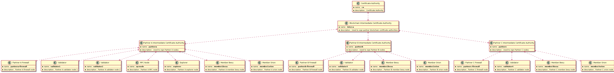

# Generate Keys

## Sample Cert Tree


## Note
Make sure to run with JDK 11 in path, anything higher will result in keystore load related errors like "Algorithm HmacPBESHA256 not available" 

### Might have to install to generate the pkcs11 keystore
```bash
sudo apt install libnss3-tools
```

## Scripts
There are a couple of key gen scripts in here. They generate the keys in **./generated/keys** and the corresponding exported version of the keys in **./generated/export**. As of now 3 types of keystore are exported using a combination of openssl, keytool and certutil
* jks
* pkcs11
* pkcs12

Most of the common functions are in [common.sh](common.sh), One can include that in their own scripts to customise the key generation.

### [gen-test-keys.sh](gen-test-keys.sh)
This script is used to generate the keys used in the [Besu - PKI Module Test Cases](https://github.com/hyperledger/besu/tree/master/pki). Copy the contents of the aove mentioned export folder to ./pki/src/test/resources/keystore/ folder in besu.


